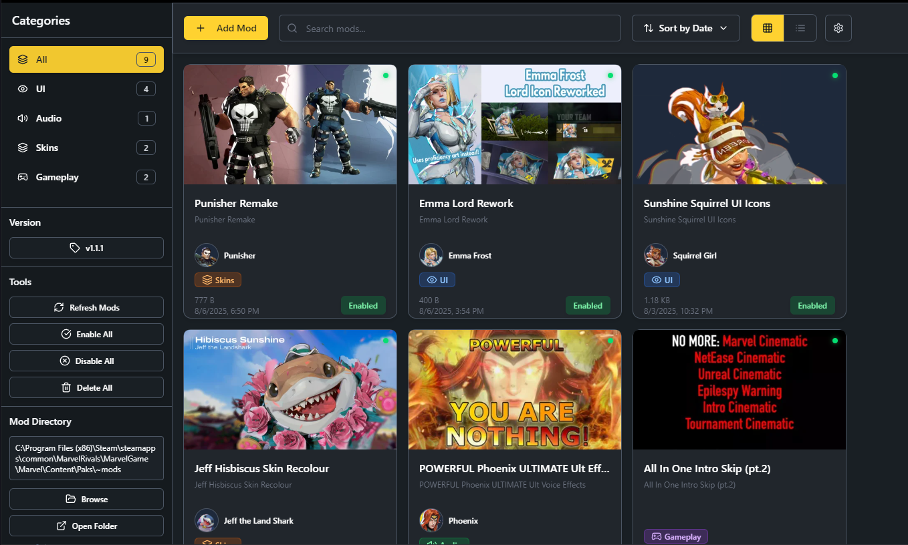

<div align="center">

# 🦸‍♂️ Marvel Rivals Mod Manager



### 🎮 The ultimate mod manager for Marvel Rivals
*Professional mod organization, theme support, and seamless installation*

[](https://github.com/Jaten-shii/marvel-rivals-mod-manager/releases)
[](https://github.com/Jaten-shii/marvel-rivals-mod-manager/releases)
[](LICENSE)
[](https://github.com/Jaten-shii/marvel-rivals-mod-manager/releases)

[📥 **Download Latest**](https://github.com/Jaten-shii/marvel-rivals-mod-manager/releases/latest) • [📖 **Documentation**](CHANGELOG.md) • [🐛 **Report Bug**](https://github.com/Jaten-shii/marvel-rivals-mod-manager/issues) • [💡 **Request Feature**](https://github.com/Jaten-shii/marvel-rivals-mod-manager/issues)

</div>

---

## ✨ Features

<table>
<tr>
<td width="50%">

### 🚀 **Installation & Management**
- 📦 **Multi-format Support** - .pak, .zip, .rar files
- 🎯 **Smart Installation** - Multi-mod selection modal
- ⚡ **Instant Activation** - Enable/disable mods instantly
- 🔄 **Real-time Monitoring** - Auto-detect file changes
- 📁 **Automatic Organization** - Smart categorization

### 🎨 **User Interface**
- 🌙 **Dual Themes** - Dark/Light with smooth transitions
- 🎭 **View Modes** - Grid and List layouts
- 🔍 **Advanced Search** - Filter by name, category, character
- 📊 **Statistics Dashboard** - Track your mod collection
- 🖼️ **Thumbnail Support** - Visual mod previews

</td>
<td width="50%">

### 🦸‍♀️ **Character Integration**
- 👥 **40+ Marvel Heroes** - Character-based organization
- 🏷️ **Smart Categorization** - UI, Audio, Skins, Gameplay
- 🎪 **Role Filtering** - Duelist, Vanguard, Strategist
- 🔤 **Auto-Detection** - Intelligent character assignment
- 📝 **Custom Metadata** - Edit descriptions and tags

### 🛠️ **Professional Tools**
- 🔧 **NSIS Installer** - Professional Windows integration
- 📎 **File associations** - .pak files open with manager
- 🎯 **Context Menus** - Right-click installation
- 🚀 **Auto-start** - Optional Windows startup
- 💾 **Settings Backup** - Preserve your configuration

</td>
</tr>
</table>

---

## 🖥️ System Requirements

| Component | Requirement |
|-----------|-------------|
| 🖥️ **OS** | Windows 10/11 (x64) |
| 💾 **RAM** | 4GB minimum, 8GB recommended |
| 💿 **Storage** | 500MB free space |
| 🎮 **Game** | Marvel Rivals (Steam/Epic) |
| ⚡ **Runtime** | Auto-installed with app |

---

## 📥 Installation

### 🎯 **Quick Install** (Recommended)
1. 📩 **Download** the latest `Marvel-Rivals-Mod-Manager-Setup.exe`
2. 🚀 **Run installer** and follow the setup wizard  
3. ✅ **Launch** from Start Menu or Desktop shortcut
4. 🎮 **Auto-detect** your Marvel Rivals installation

### 🔧 **Advanced Setup**
```bash
# Clone repository
git clone https://github.com/Jaten-shii/marvel-rivals-mod-manager.git
cd marvel-rivals-mod-manager

# Install dependencies
pnpm install

# Development
pnpm dev

# Build production
pnpm build
```

---

## 🛠️ Technology Stack

<div align="center">

### 🚀 **Core Technologies**
[](https://electronjs.org/)
[](https://reactjs.org/)
[](https://typescriptlang.org/)
[](https://nodejs.org/)

### 🎨 **UI & Styling**
[](https://tailwindcss.com/)
[](https://radix-ui.com/)
[](https://framer.com/motion/)

### 🔧 **Build & Tools**
[](https://vitejs.dev/)
[](https://pnpm.io/)
[](https://biomejs.dev/)

</div>

---

## 🎮 How to Use

### 📦 **Installing Mods**
1. **🎯 Add Mod Button** - Browse and select mod files
2. **🗂️ File Browser** - Navigate to your mod files
3. **📋 Multi-Selection** - Choose which mods to install from archives
4. **✅ Auto-Organization** - Mods are automatically categorized

### 🎨 **Organizing Your Collection**
- **🏷️ Categories**: UI, Audio, Skins, Gameplay
- **🦸‍♂️ Characters**: Filter by 40+ Marvel heroes  
- **🔍 Search**: Find mods by name or description
- **📊 Statistics**: Track your collection size and types

### ⚙️ **Settings & Preferences**
- **🌙 Themes**: Switch between Dark/Light modes
- **👁️ View Modes**: Toggle between Grid/List layouts
- **📁 Game Path**: Auto-detect or manually set Marvel Rivals location
- **🔄 Auto-Organization**: Enable/disable automatic categorization

---

## 🤝 Contributing

We welcome contributions! Here's how you can help:

### 🐛 **Report Issues**
- [🔍 Check existing issues](https://github.com/Jaten-shii/marvel-rivals-mod-manager/issues)
- [📝 Create new issue](https://github.com/Jaten-shii/marvel-rivals-mod-manager/issues/new)
- 🔥 Include logs and screenshots

### 💻 **Code Contributions**
```bash
# 1. Fork the repository
# 2. Create feature branch
git checkout -b feature/amazing-feature

# 3. Make changes and test
pnpm dev
node validate.js

# 4. Commit your changes
git commit -m "✨ Add amazing feature"

# 5. Push and create PR
git push origin feature/amazing-feature
```

### 📋 **Development Guidelines**
- ✅ Follow TypeScript best practices
- 🎨 Use Tailwind CSS for styling
- 🧪 Test your changes thoroughly  
- 📝 Update documentation as needed
- 🎯 Keep PRs focused and atomic

---

## 📈 Roadmap

### 🚀 **Coming Soon**
- [ ] 🌐 **Multi-language Support** - Localization for multiple languages
- [ ] ☁️ **Cloud Sync** - Sync mod collections across devices
- [ ] 🎨 **Custom Themes** - Create and share custom themes
- [ ] 📱 **Mobile Companion** - Remote management app
- [ ] 🤖 **Auto-Updates** - Automatic mod and app updates

### 🔮 **Future Plans**
- [ ] 🎮 **Multiple Games** - Support for other games
- [ ] 🏪 **Mod Store** - Browse and download mods directly
- [ ] 👥 **Community Features** - Share collections and reviews
- [ ] 📊 **Advanced Analytics** - Detailed usage statistics
- [ ] 🔌 **Plugin System** - Extend functionality with plugins

---

## 📞 Support & Links

<div align="center">

### 📬 **Get Help**
[](https://discord.gg/your-discord)
[](https://github.com/Jaten-shii/marvel-rivals-mod-manager/issues)
[](mailto:support@marvelrivalsmodmanager.com)

### 📱 **Follow Updates**
[](https://github.com/Jaten-shii/marvel-rivals-mod-manager)
[](https://github.com/Jaten-shii/marvel-rivals-mod-manager/releases)

</div>

---

## ⭐ Show Your Support

If you find this project helpful, please consider:

- ⭐ **Star this repository**
- 🍴 **Fork and contribute**  
- 🐛 **Report bugs and issues**
- 💡 **Suggest new features**
- 📢 **Share with the community**

---

## 📄 License

This project is licensed under the **MIT License** - see the [LICENSE](LICENSE) file for details.

### ⚖️ **Disclaimer**
- 🚫 Not affiliated with **NetEase Games** or **Marvel Entertainment**
- 🎮 Marvel Rivals is a trademark of **NetEase Games**
- 🦸‍♂️ Marvel characters are property of **Marvel Entertainment**
- 🛡️ Use mods at your own risk - we are not responsible for game issues

---

<div align="center">

### 🌟 **Made with ❤️ for the Marvel Rivals Community**


**[⬆ Back to Top](#-marvel-rivals-mod-manager)**

</div>