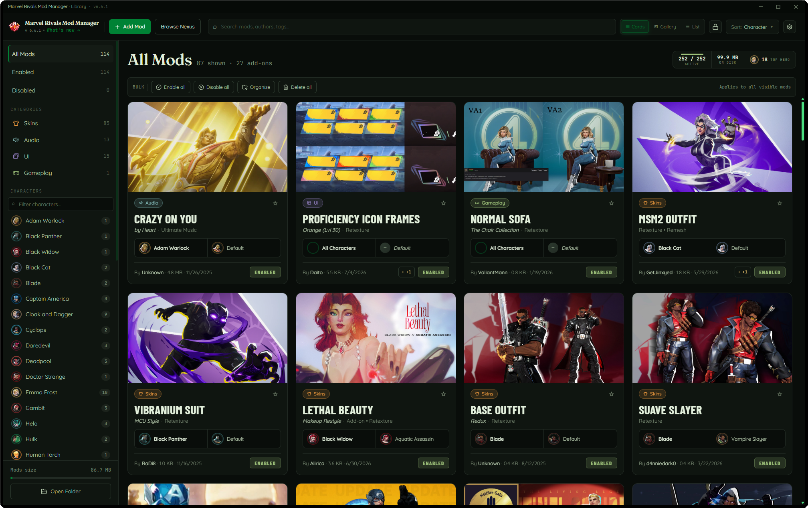
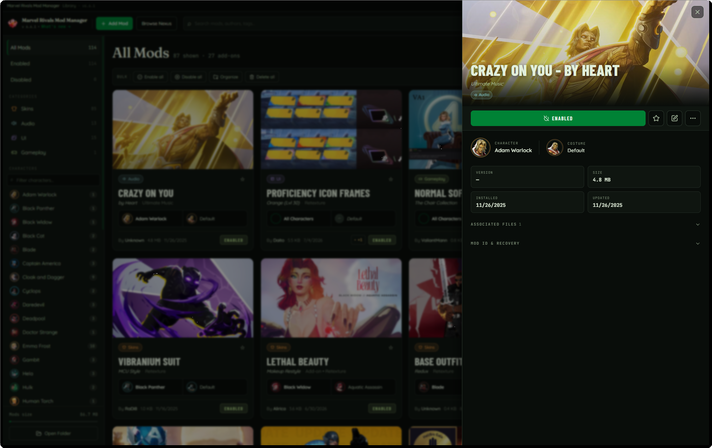
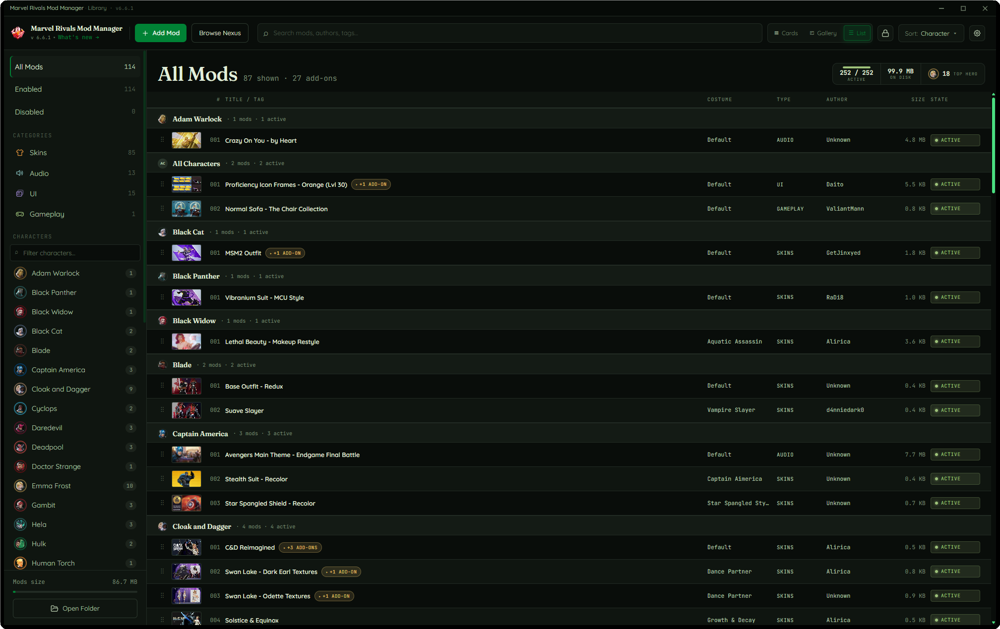

<div align="center">

# Marvel Rivals Mod Manager

**Professional Mod Management for Marvel Rivals**

[](https://github.com/Jaten-shii/marvel-rivals-mod-manager/releases)
[](https://github.com/Jaten-shii/marvel-rivals-mod-manager/releases)
[](LICENSE.md)

A lightweight, fast desktop application built with Tauri for seamless mod management in Marvel Rivals.

[Download Latest Release](https://github.com/Jaten-shii/marvel-rivals-mod-manager/releases) · [Report Bug](https://github.com/Jaten-shii/marvel-rivals-mod-manager/issues) · [Request Feature](https://github.com/Jaten-shii/marvel-rivals-mod-manager/issues)

</div>

---

<div align="center">



<sub>Your library at a glance — artwork cards, category and character filters, one-click enable</sub>

</div>

<table>
  <tr>
    <td width="50%">
      
      <p align="center"><sub>Details panel with artwork, costume info, and file recovery</sub></p>
    </td>
    <td width="50%">
      
      <p align="center"><sub>List view grouped by character</sub></p>
    </td>
  </tr>
</table>

---

## Features

### Core
- **Drag & Drop Installation** — Install from `.pak`, `.zip`, and `.rar` files
- **Smart Auto-Organization** — Automatic categorization by UI, Audio, Skins, and Gameplay
- **Character Filtering** — Browse mods by 45+ Marvel Rivals heroes
- **Profile Management** — Multiple mod configurations for different playstyles
- **Real-Time Monitoring** — Auto-detect changes in mod directory

### Interface
- **5 Themes** — Dark Classic, Light Classic, Forest, Ruby, and Ice
- **Grid & List Views** — Switch between layouts
- **Details Panel** — Rich mod info with custom thumbnails and character/costume icons
- **Advanced Search** — Find mods by name, category, or character

### Advanced
- **Auto-Updater** — Seamless app updates with cryptographic signing
- **Custom Thumbnails** — Personalize your mods with custom images
- **Bulk Operations** — Enable, disable, or remove multiple mods at once
- **Changelog Viewer** — In-app release notes with timeline view
- **File Associations** — Double-click `.pak` files to open directly in the mod manager

---

## Getting Started

### Installation

1. **Download** the latest installer from [Releases](https://github.com/Jaten-shii/marvel-rivals-mod-manager/releases)
2. **Run** the setup executable
3. **Launch** — game directory auto-detection handles the rest

### System Requirements

| Requirement | Minimum |
|------------|---------|
| OS | Windows 10/11 (64-bit) |
| Game | Marvel Rivals (Steam) |
| Disk Space | ~15 MB |
| RAM | 100 MB |

---

## Usage

### Installing Mods

- **Drag & Drop** — Drag mod files directly into the app window
- **File Browser** — Click "Add Mod" to select files from your PC
- **Auto-Extract** — ZIP and RAR archives extract automatically

### Managing Your Collection

- **Search** — Find specific mods instantly
- **Filter** — Sort by category or character
- **Enable/Disable** — Toggle mods on/off with a single click
- **Profiles** — Create separate mod setups for competitive vs. casual play

---

## Built With

| | |
|---|---|
| **Frontend** | React 19, TypeScript, Tailwind CSS, Vite |
| **Backend** | Tauri 2, Rust |
| **UI** | shadcn/ui, Lucide React, Zustand |

---

## Building from Source

### Prerequisites

- [Node.js](https://nodejs.org/) v20+
- [Rust](https://rustup.rs/) (latest stable)
- [pnpm](https://pnpm.io/) v10+

### Quick Start

```bash
git clone https://github.com/Jaten-shii/marvel-rivals-mod-manager.git
cd marvel-rivals-mod-manager
pnpm install
pnpm dev
```

---

## License

MIT License — see [LICENSE.md](LICENSE.md) for details.

---

## Disclaimer

**Marvel Rivals Mod Manager** is a community-created tool and is not affiliated with, endorsed by, or associated with NetEase Games or Marvel Entertainment. Use mods at your own risk. Always backup your game files before installing mods.

---

<div align="center">

Made by the Marvel Rivals modding community

[Back to Top](#marvel-rivals-mod-manager)

</div>
